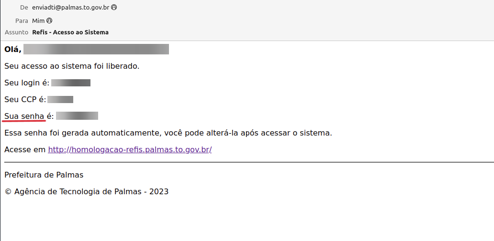

# Esqueci a senha 
Preencha o CPF/CNPJ, email e CCP, caso não saiba o CCP clique em **"Consultar CCP"**, após os preenchimento dos 
campos clique em **"Enviar Acessos"**, logo em seguida exibirá uma mensagem informando ***"Um email foi enviado com 
as instruções de acesso".***
  

## Senha no email 
Em seu email receberá uma nova senha de acesso. Essa senha foi gerada automaticamente, você pode alterá-la após acessar 
o sistema.

  

## Alterar a senha gerada automaticamente
Após acessar o sistema com a senha gerada automaticamente, você pode alterá-la, para isso clique em **Perfil** 
como na imagem a seguir.

  

Em seguida clique em **Alterar Senha** para visualizar o formulário de alteração de senha, como na imagem a seguir.

Preencha os campos **Senha Atual**, **Nova Senha** e **Confirmar Senha** e clique em **Salvar** para definir a nova
senha.

> Lembre-se de sempre consultar a documentação quando surgir alguma dúvida.