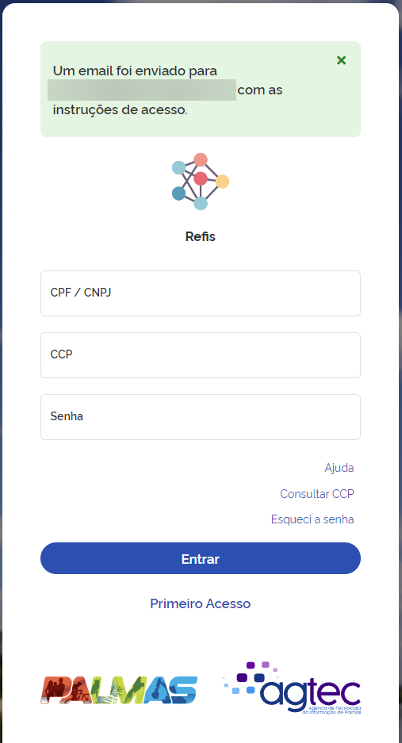
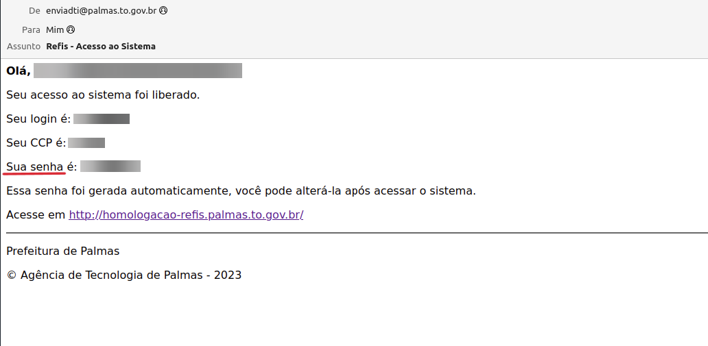

# Primeiro acesso 
Preencha o CPF/CNPJ, email e CCP, caso não saiba o CCP clique em **"Consultar CCP"**, após os preenchimento dos 
campos clique em **"Enviar Acessos"**, logo em seguida exibirá uma mensagem informando ***"Um email foi enviado com 
as instruções de acesso".***
  

## Senha no email 
Acesse seu email e use a senha gerada para acessar o sistema do refis como mostra a imagem a seguir.

  

> Lembre-se de sempre consultar a documentação quando surgir alguma dúvida.
