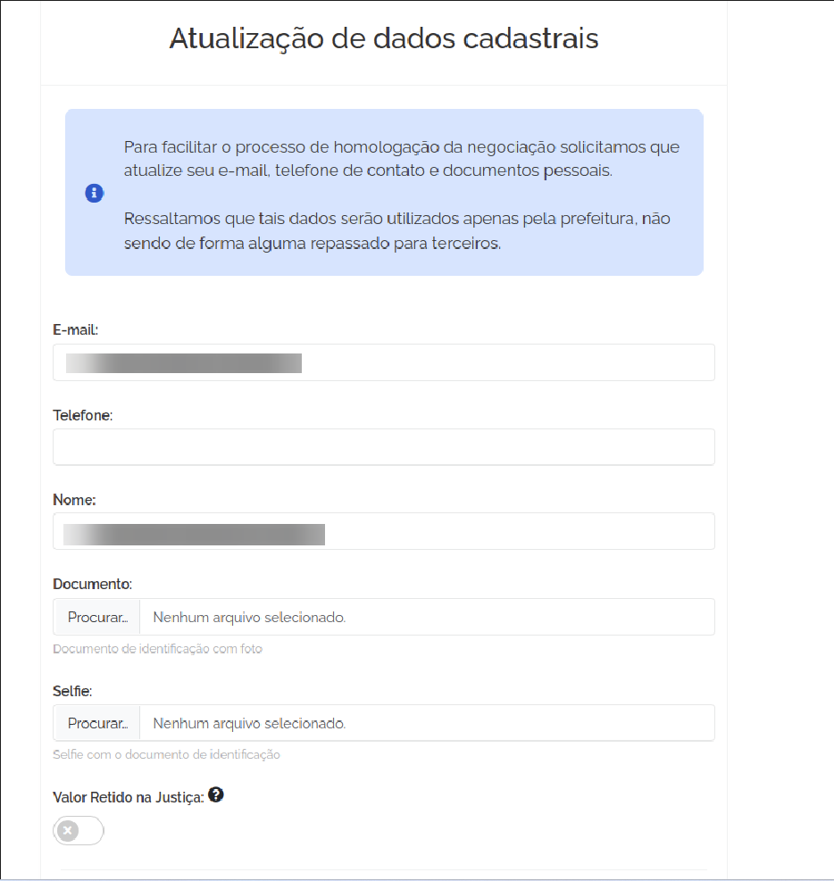
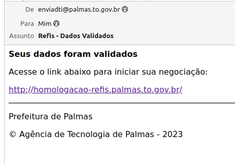

# Atualização cadastral
 
Logo após o acesso deve realizar uma atualização dos seus dados cadastrais, anexar documentos e Selfie e aguardar 
a liberação de acesso para realizar as negociações.

## Validação cadastral
Assim que as informações forem validadas será enviado um email informando que seus dados foram validados como mostra na
imagem a seguir.

  

> Lembre-se de sempre consultar a documentação quando surgir alguma dúvida.

