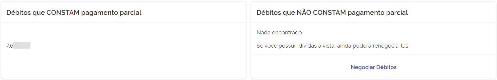
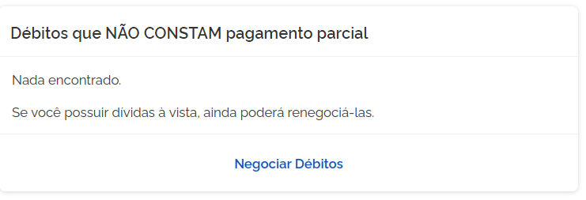

# Negociações realizadas
Em **Negociações Realizadas** o contribuinte tem acesso as negociações que foram realizadas no ***REFIS*** atual, ao acessar
terá as opções:   

1. Débitos que constam pagamento parcial:

      

2. Débitos que não constam pagamento parcial:

    

> Lembre-se de sempre consultar a documentação quando surgir alguma dúvida.

