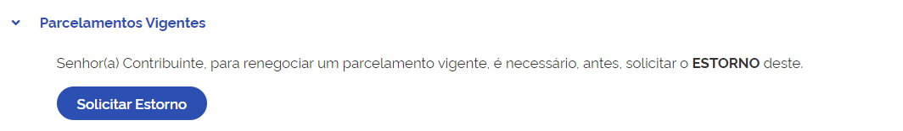
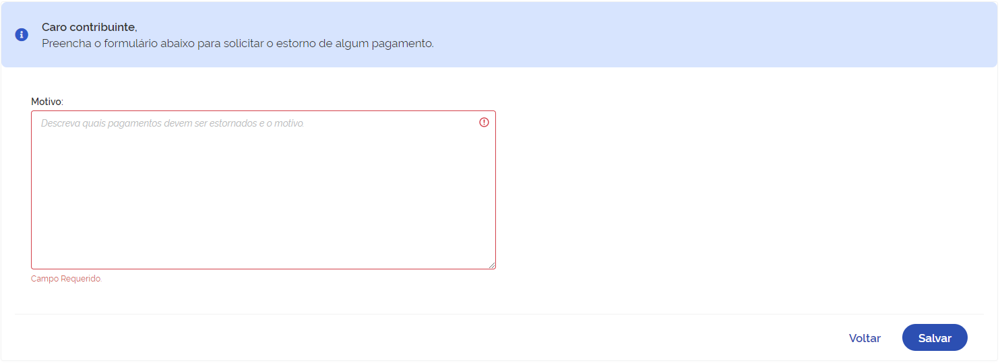

# Parcelamentos vigentes  
Em **Parcelamentos Vigentes** é possível solicitar a renegociação de parcelamentos já em andamento. Mas antes de 
realizar a renegociação é necessário realizar a solicitação de estorno do parcelamento.

 

Ao clicar em **Solicitar Estorno** será exibido a tela para informar o motivo do estorno, como mostra a imagem a seguir.

 

> Lembre-se de sempre consultar a documentação quando surgir alguma dúvida.
