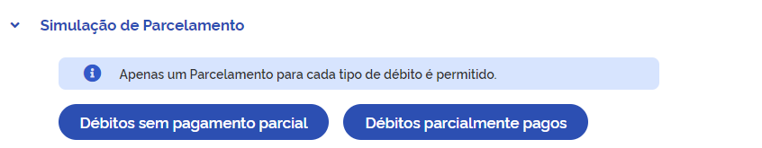
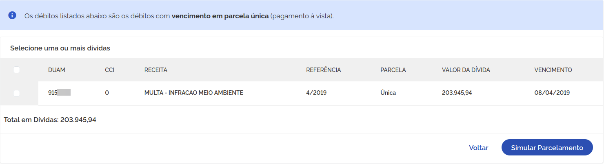
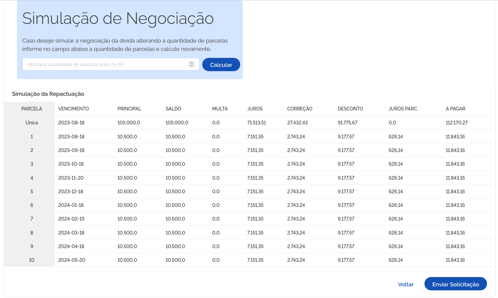
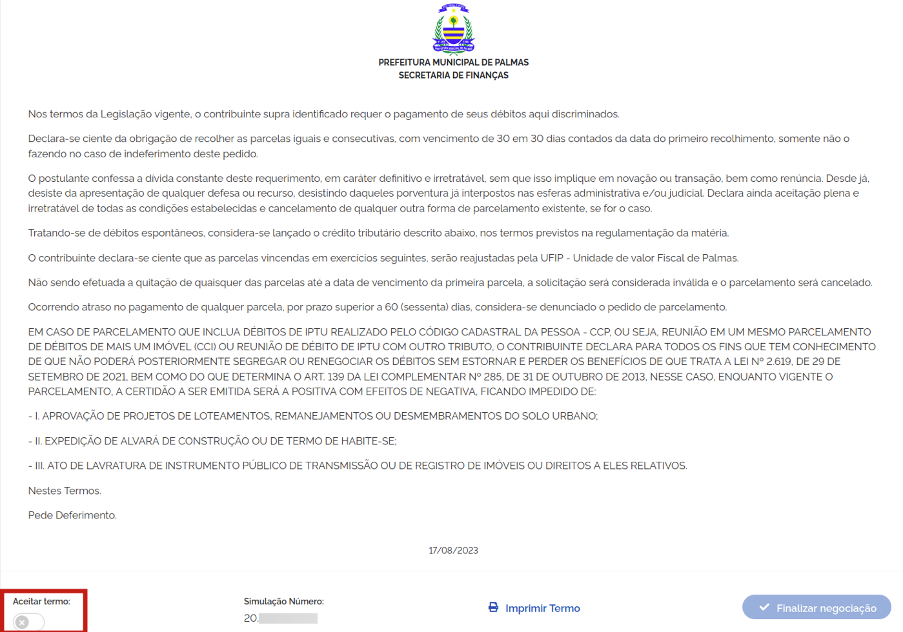
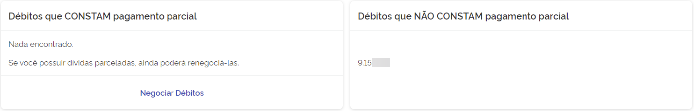
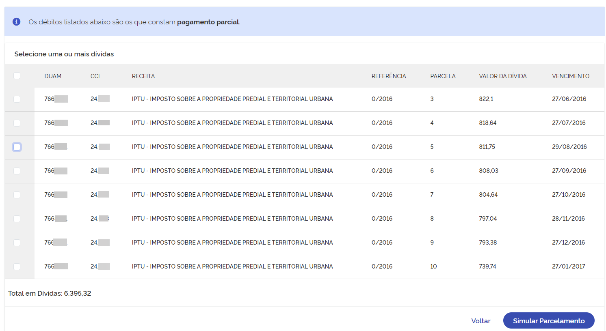
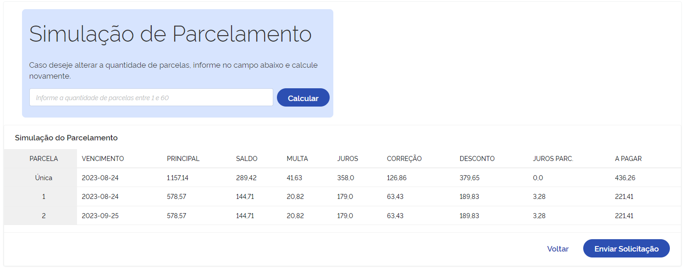
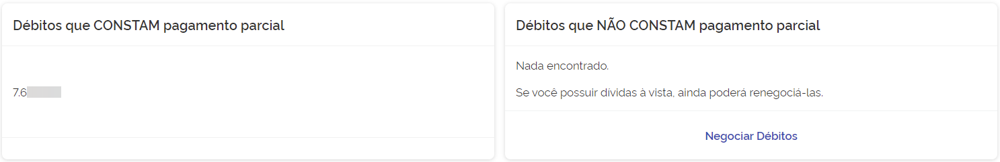

# Simulação de negociação
Em **Simulação de Negociação** é possível verificar por débitos que não foram parcelados e débitos que já
foram parcelados para realizar a simulação. Como mostra a seguir são duas opções **Débitos sem pagamento parcial** e 
**Débitos parcialmente pagos**.

## Débitos sem pagamento parcial
   1. Ao selecionar a opção **Débitos sem pagamento parcial** será exibido uma ou mais dívidas conforme imagem a seguir:
   

   2. Seleciona as dívidas que deseja realizar a simulação, em seguida será direcionado para a página onde poderá 
   escolher de 1 a 60 parcelas conforme imagem a seguir:
   

   3. Depois de simular e clicar em **Enviar solicitação** será apresentado o termo de aceite. Nesta página o 
   contribuinte deve ler o termo e realizar o aceite do termo para poder finalizar a negociação conforme imagem a seguir:
   

   4. Após finalizar a negociação o contribuinte é redirecionado para a tela negociações realizadas onde encontraŕa os 
   débitos com pagamento parcial e os que não constam pagamento parcial.
   

## Débitos parcialmente pagos
   1. Ao selecionar a opção **Débitos parcialmente pagos** será exibido uma ou mais dívidas conforme imagem a seguir:
   

   2. Seleciona as dívidas que deseja realizar a simulação, em seguida será direcionado para a página onde poderá 
   escolher de 1 a 60 parcelas conforme imagem a seguir:
   

   3. Depois de simular e clicar em **Enviar solicitação** será apresentado o termo de aceite. Nesta página o 
   contribuinte deve ler o termo e realizar o aceite do termo para poder finalizar a negociação conforme imagem a seguir:
   

   4. Após finalizar a negociação o contribuinte é redirecionado para a tela negociações realizadas onde encontraŕa os 
   débitos com pagamento parcial e os que não constam pagamento parcial.
   

> Lembre-se de sempre consultar a documentação quando surgir alguma dúvida.
