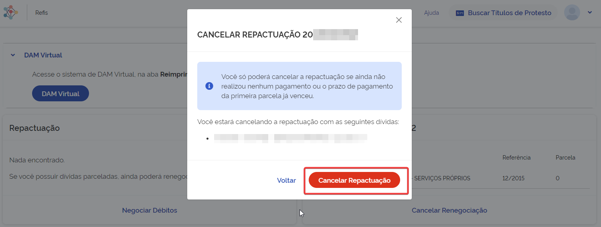
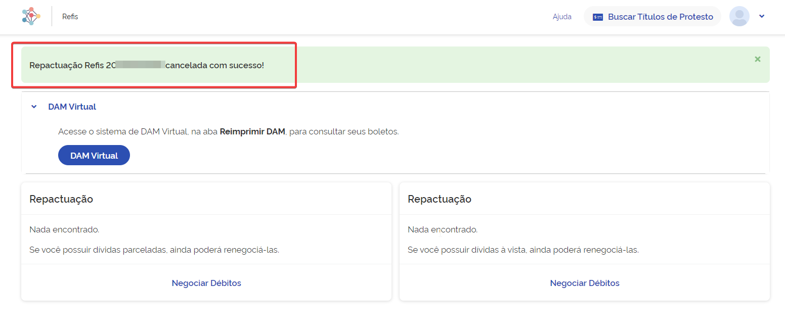

# Cancelar renegociação
Nesta opção é possível cancelar uma renegociação que foi realizada anteriormente. O ato de cancelar uma renegociação 
permite ao contribuinte realizar uma nova simulação para o mesmo débito.
    
1. Primeiro, acesse negociações realizadas onde consta a lista de negociações realizadas pelo contribuinte. Selecione
qual deseja cancelar ao clicar em *Cancelar Renegociação*.
.png)
2. Será exibida uma mensagem de confirmação e os dados da Repactuação, confira os dados e clique em
*Cancelar Repactuação* para confirmar o cancelamento.

3. Uma mensagem de confirmação do cancelamento da renegociação sera apresentado. Agora já é possível realizar uma nova
simulação para o mesmo débito.

> Lembre-se de sempre consultar a documentação quando surgir alguma dúvida.
