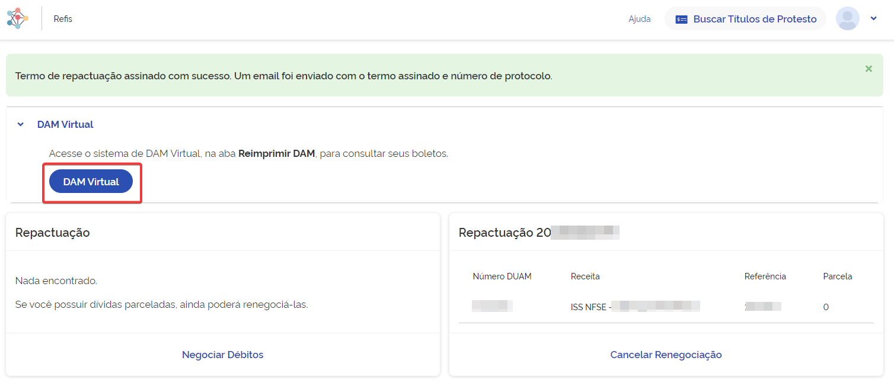
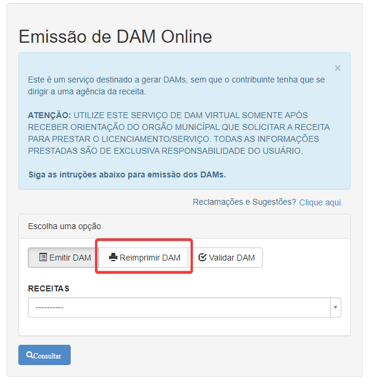
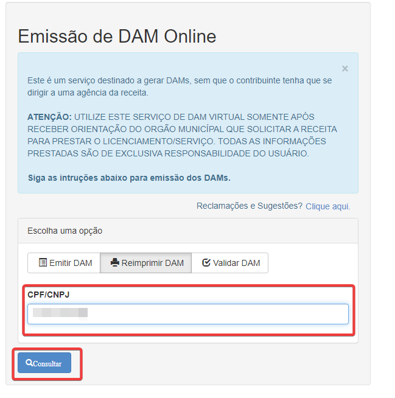
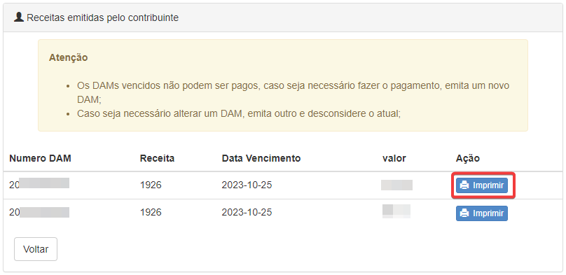

# Gerar DAM virtual
Após a simulação, o contribuinte pode gerar o DAM Virtual para realizar o pagamento do débito. Para isso, siga os passos
abaixo:
    
1. Após a simulação, clique no botão *DAM Virtual*, que será redirecionado para a página de geração da DAM.

2. Clique em *Reimprimir DAM* para colocar seu CPF.

3. Coloque seu CPF e clique em *Consultar*.

4. Após a consulta, será apresentado duas DAMs, a primeira é a DAM com valor a vista e a segunda é a primeira parcela
da sua renegociação caso tenha optado por parcelar. Clique em *Imprimir* para gerar a DAM.

> Lembre-se de sempre consultar a documentação quando surgir alguma dúvida.
